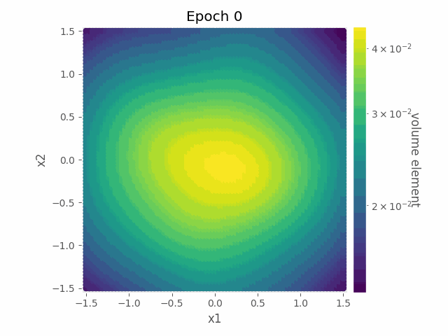
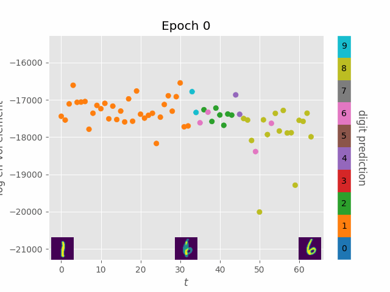
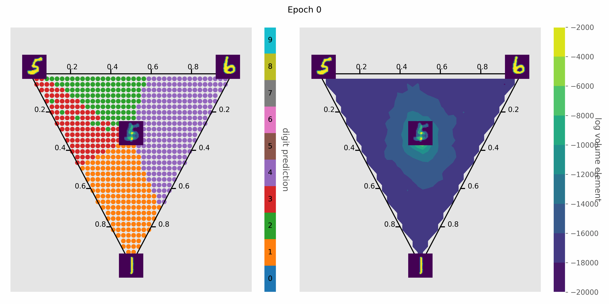

# [nn_curvature](https://arxiv.org/abs/2301.11375)

This project empirically shows neural network training molds feature maps to expand areas near decision boundaries. For details, see our preprint [Neural networks learn to magnify areas near decision boundaries](https://arxiv.org/abs/2301.11375).

## Galaries

| Description | Figures |
| :-: | :-: |
| Volume element of a single hidden layer (250 hidden units) architecture trained on sinusoid binary classification task |  |
| Volume element of a 3-hidden-layer (8 hidden units each) architecture trained on sinusoid binary classification task |  |
| Volume element of linear interpolation between two MNIST digits (1 and 6) using a single hidden layer (2000 hidden units) architecture |  |
| Volume element of interpolated digits in a plane spanned by three MNIST digits (5, 6, and 1) |   |

## Setup

To setup the environment, at root, run

```bash
conda env create -f environment.yml
conda activate curvature
```

## Run Experiments

To run experiments, we first need to specify paths for data, model temp files, and visualizations in [config.toml](config.toml). Different experiments can have separate folders to store final results. One example is

```toml
['exp']
data_dir='data/'
result_dir='img/'
model_dir='model/'
```

Next specify the ```tag``` argument in each bash script before running so that it reads the coresponding paths in [config.toml](config.toml). To run cifar, for instance, at root:

```bash
bash commands/train_cifar.sh
```

## Acknowledgement

Author: Julian Alex Rubinfien, Sheng Yang, Jacob A Zavatone-Veth, Cengiz Pehlevan
